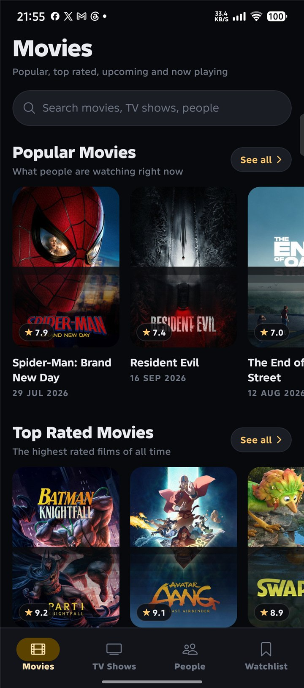
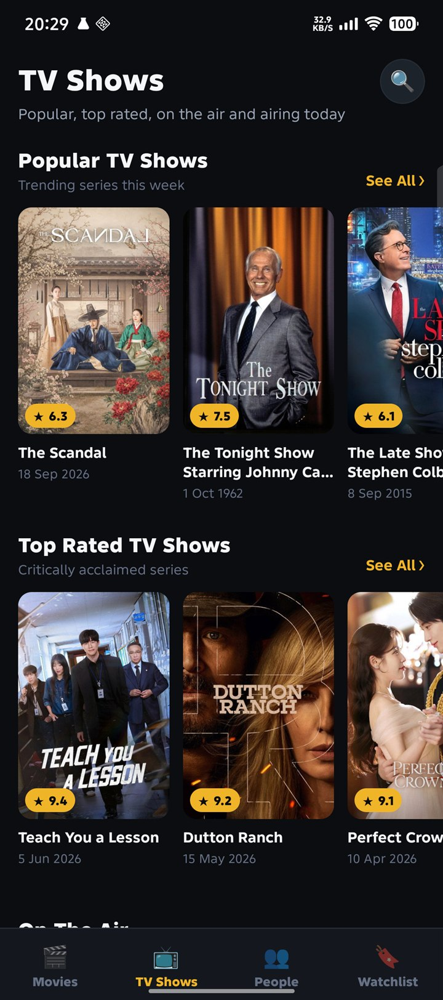
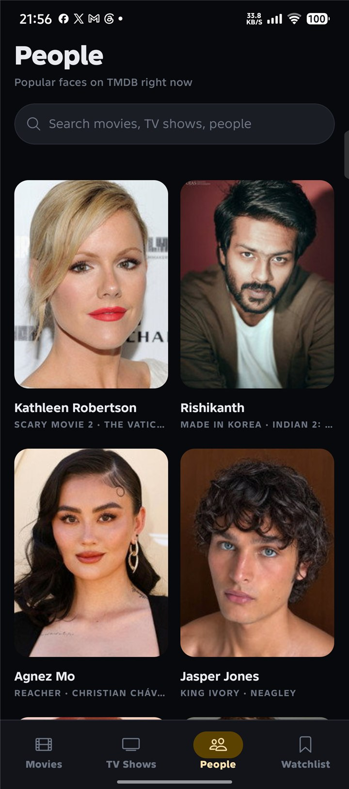
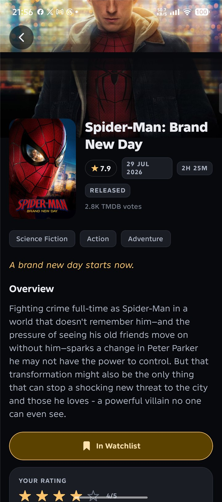
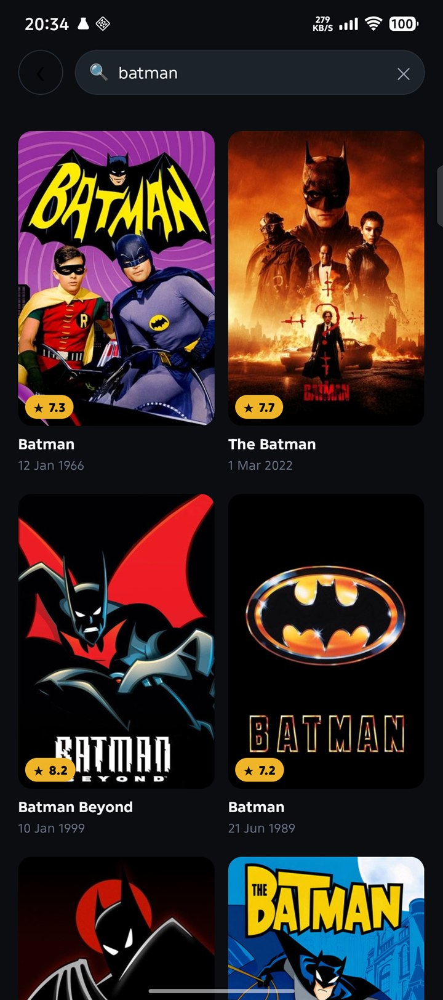
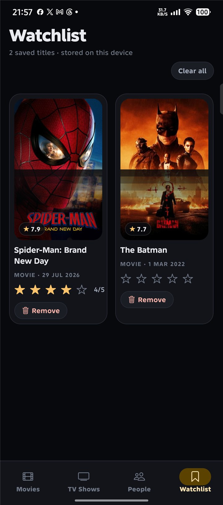
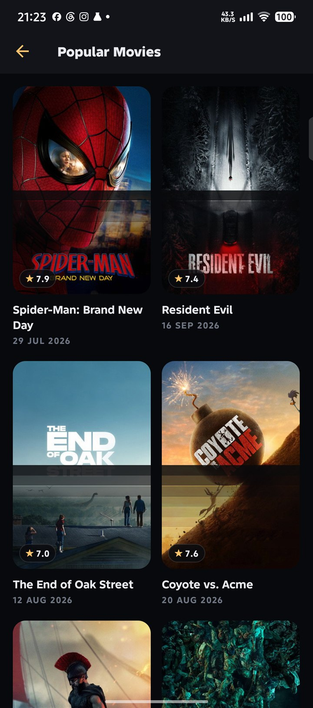

# CineCatalog

A TMDB browser built with React Native CLI (not Expo) for the App Developer test at Elemes Group.
Four tabs — Movies, TV Shows, People, Watchlist — with all nine lists from the brief, plus search, a
watchlist and a star rating that survive an app restart.

## Screenshots

Live captures from the release build on a physical phone (Infinix X6855, Android 16).

| Movies | TV Shows | People |
|---|---|---|
|  |  |  |

| Movie detail | Search | Watchlist |
|---|---|---|
|  |  |  |



## Tech stack

| Layer | Choice |
|---|---|
| Framework | React Native CLI 0.85.2 (not Expo), New Architecture on |
| Language | TypeScript, strict |
| State | Redux Toolkit + RTK Query |
| Navigation | React Navigation 7 — native stack plus bottom tabs |
| Storage | AsyncStorage, for the watchlist and the ratings |
| Images | `@d11/react-native-fast-image`, the Fabric-ready fast-image fork |
| Icons | `@react-native-vector-icons/ionicons` |
| Styling | `StyleSheet` API, every value from the tokens in `src/shared/theme` |
| Testing | Jest + React Native Testing Library |
| Lint / format | ESLint (`@react-native/eslint-config`) + Prettier |
| Env | `react-native-dotenv` |

## Running it

You need Node 22+, JDK 17, and the Android SDK with `ANDROID_HOME` pointing at it.

```bash
git clone https://github.com/hafidrf/elemes-tmdb-app.git
cd elemes-tmdb-app
npm install
cp .env.example .env      # Windows: Copy-Item .env.example .env
```

### Setting up .env

Get a key at https://www.themoviedb.org/settings/api. Either kind works: the v4 read access token
(the long `eyJ...` string) or the v3 32-character key.

```ini
TMDB_READ_ACCESS_TOKEN=eyJ...
TMDB_API_KEY=
```

`.env` is git-ignored, so the key never reaches the repo. The v4 token goes out as
`Authorization: Bearer ...`; if only the v3 key is set, requests fall back to the `api_key` query
param instead.

### Starting it

```bash
npm start                 # terminal 1 — Metro
npm run android           # terminal 2 — build, install, launch
```

Or build a standalone release APK, which does not need Metro at all:

```bash
cd android
./gradlew assembleRelease          # Windows: gradlew.bat assembleRelease
adb install -r app/build/outputs/apk/release/app-release.apk
adb shell am start -n com.elemestmdbapp/.MainActivity
```

On iOS the native modules come from CocoaPods, so run `cd ios && pod install` once after
`npm install`.

### Scripts

| Command | Does |
|---|---|
| `npm start` | Metro |
| `npm run android` | build, install, launch |
| `npm test` | Jest, 52 tests |
| `npm run lint` | ESLint |
| `npx tsc --noEmit` | type check |

## The nine lists

The brief asks for at least four of these. All nine are in the app. Movies and TV show them as
horizontal shelves, each with a See all button that opens a full paginated grid; People is a grid.

| # | List | Endpoint | Where |
|---|---|---|---|
| 1 | Top rated movies | `movie/top_rated` | Movies tab, shelf 2 |
| 2 | Upcoming movies | `movie/upcoming` | Movies tab, shelf 3 |
| 3 | Now playing movies | `movie/now_playing` | Movies tab, shelf 4 |
| 4 | Popular movies | `movie/popular` | Movies tab, shelf 1 |
| 5 | Popular TV shows | `tv/popular` | TV Shows tab, shelf 1 |
| 6 | Top rated TV shows | `tv/top_rated` | TV Shows tab, shelf 2 |
| 7 | On the air TV shows | `tv/on_the_air` | TV Shows tab, shelf 3 |
| 8 | Airing today TV shows | `tv/airing_today` | TV Shows tab, shelf 4 |
| 9 | Popular people | `person/popular` | People tab |

The rest of what the brief asks for:

- **Splash screen** — native Android launch theme, swapped for the real theme in
  `MainActivity.onCreate`.
- **Loading state** — skeleton placeholders shaped like the real cards, plus a spinner while paging.
- **Search** — `/search/multi` behind a 400 ms debounce, so one bar covers movies, TV and people.
- **Rating and watchlist** — both, stored in AsyncStorage, reachable from every detail screen and
  from the Watchlist tab.
- **Error and empty states** — one `StateView`, always with a Retry button, never a blank screen.
- **Pull to refresh, infinite scroll**, and an offline banner.

## Code layout

```
src/
  app/          navigation and the redux store
  constants/    TMDB urls/sizes, plus the one file that reads @env
  features/
    catalog/    the nine lists, the shelves, the See all grids
    people/     popular people grid
    detail/     movie, TV and person detail screens
    search/     search screen
    watchlist/  slice, storage, watchlist screen
  shared/
    api/        RTK Query client
    components/ cards, skeletons, states, icons
    theme/      colours, type scale, layout numbers
    types/      TMDB response types and the shared view models
    utils/      formatters, image urls
```

`shared/` never imports from `features/`.

## Known issues

1. **iOS is untested.** The code is platform agnostic and `ios/` is intact, but it was built and run
   on Android only. The brief allows Android Studio, and this was done on Windows.
2. **Metro's dev server would not start on the machine this was built on.** Metro 0.84.6 on Windows
   without watchman dies with `Failed to get the SHA-1 for: .../metro-runtime/src/polyfills/require.js`.
   `gradlew assembleRelease` and `gradlew assembleDebug` both work, which is why the app was verified
   through the release build. Installing watchman should clear it.
3. **No trailer playback.** `GET /movie/{id}/videos` is wired into the API layer but nothing plays it.
   The watchlist and rating requirement got the time instead.
4. **`.env` is required.** Without it the app still starts, every request fails, and you land on the
   error state with a Retry button instead of a crash.

## Tests

```bash
npm test          # 52 tests in 5 suites
npm run lint      # eslint, no errors or warnings
npx tsc --noEmit  # no type errors
```

